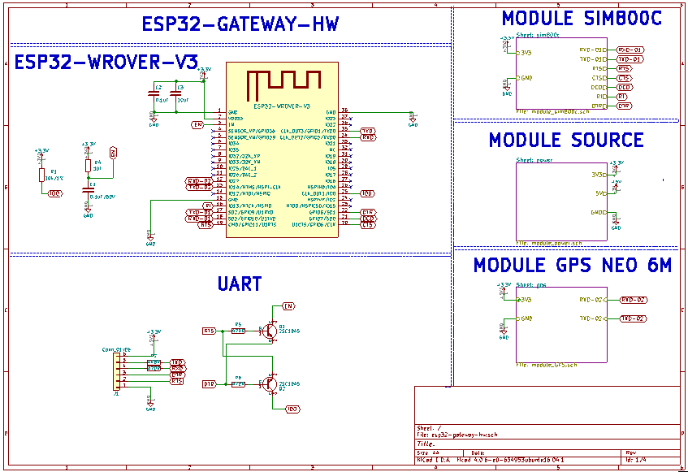
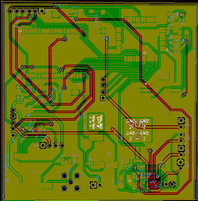

# esp32-gateway-hw

## Features

esp32-gateway-hw có thể:
- Điện áp ngõ vào 4 đến 40VDC.

- Sử dụng được nguồn DC, USB, Pin ( có chức năng tự sạc).

- Theo dõi vị trí và trả về thông tin cho người dùng thông qua module GPS Neo6m và module GSM Sim800c.

- Hệ thống đèn báo nguồn , GPS , GSM.

# Nguyên lý hoạt động

- SHield sử dụng module GPS neo6m để định vị tọa độ của thiết bị thông qua hệ thống định vị toàn cầu (GPS) sau đó gửi thông tin toạ độ thiết bị đến người dùng thông qua module sim800c

## Hardware

### Các module đi kèm

ESP32-WROVER-V3

GSM SIM800C

GPS NEO6M

### Schematics

### PCB Layout

### 3D

### Gerber

//[Download](./assets/esp32-cam-shield.zip)

### BOM 

| Designator | Package | Quantity | Designation  |
|---------------------|--------------------------------|----------|-------------------------|
|		      |		                       |	  |	                    |
### Remark

This project was in development phase - we will remove this remark after release

# License

